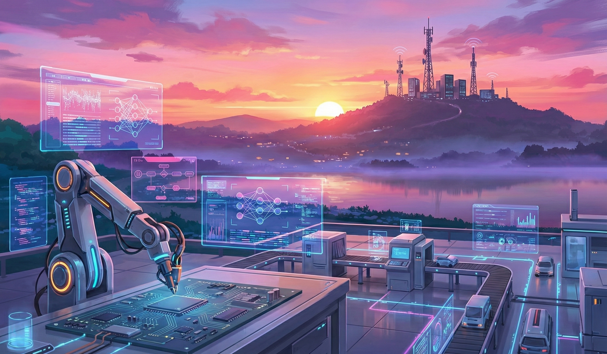

<!-- <h1 align="center">ٱلسَّلَامُ عَلَيْكُمْ </h1>   -->
<!-- <h1 align="center">I'm Muhammad Azizur Rahman </h1>  -->

  

 <!-- 
  
  -->
  

  

  
  
  
  

---

## 🧠 About Me

- 🎓 **B.Sc. in Electrical & Electronic Engineering (EEE)** from **BUET**  
  Major in *Communication & Signal Processing*

- 🔬 Research background in **Deep Learning**, with a **peer-reviewed journal publication**

- 🤖 Working interest in **LLM-powered automation systems**, **AI agents**, and **workflow orchestration**

- ⚙️ Passionate about building **end-to-end AI pipelines**, local AI services, and **production-ready automations**

- 🧩 Enjoys combining **AI research + practical engineering** to solve real-world problems

---

## 🛠 Tech Stack

  

  
  
  

---

## 📫 Reach Me
- 📧 Email: **azizureee19@gmail.com**
- 🌐 Portfolio: https://ar-titumir.github.io

---

  <i>Building practical AI systems — not just demos.</i>

  

